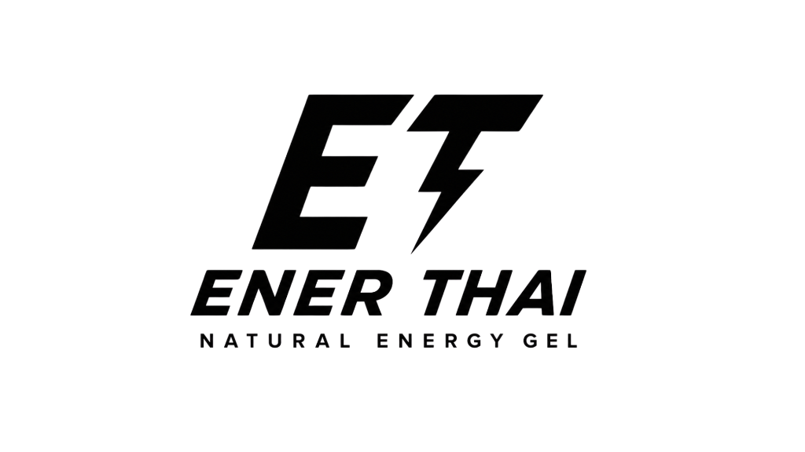
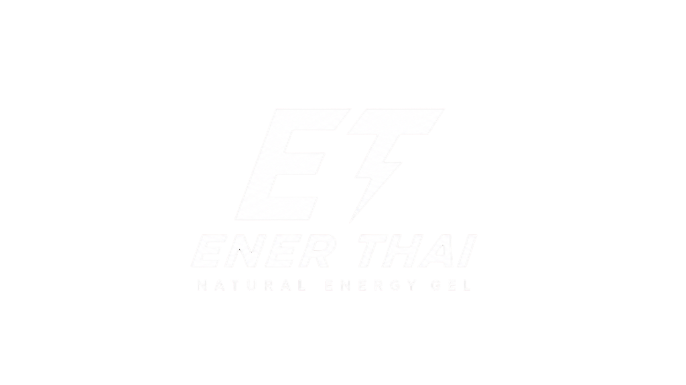

# Implementation Plan - Brand Assets & Packaging Integration

Integrate the newly acquired brand assets (black and white logos, and three gel sachet packaging designs) into the **EnerThai** website, replacing all temporary inline SVG logos and CSS-gradient placeholders.

---

## Brand Assets & Mapping

The uploaded files located in the root directory will be organized into a dedicated `assets` directory:
- `media__1781534740526.png` → `assets/logo-white.png` (White logo for dark backgrounds/dark theme)
- `media__1781534740531.png` → `assets/logo-black.png` (Black logo for light backgrounds/light theme)
- `media__1781534740806.png` → `assets/gel-sunrise.png` (SUNRISE gel packaging sachet)
- `media__1781534740799.png` → `assets/gel-strike.png` (STRIKE gel packaging sachet)
- `media__1781534740792.png` → `assets/gel-sunset.png` (SUNSET gel packaging sachet)

---

## User Review Required

> [!NOTE]
> The dynamic theme toggling for the header logo is handled via CSS classes mapping directly to the `body.dark-theme` modifier. This ensures instant logo color swaps without reliance on JavaScript timing.
>
> In the footer, since the background is permanently dark (`#111111`), we always display the white logo.

---

## Proposed Changes

### 1. Asset Directory Setup

#### [NEW] `assets/`
Create the `assets/` directory and populate it with renamed PNG assets for logos and sachets.

---

### 2. Header and Footer Logo Updates (All 8 Pages)

Modify the header and footer sections on:
- [index.html](file:///C:/Users/Kaopan/.gemini/antigravity/brain/f054b131-c7b5-44a1-91e6-977638858d86/index.html)
- [products.html](file:///C:/Users/Kaopan/.gemini/antigravity/brain/f054b131-c7b5-44a1-91e6-977638858d86/products.html)
- [product.html](file:///C:/Users/Kaopan/.gemini/antigravity/brain/f054b131-c7b5-44a1-91e6-977638858d86/product.html)
- [calculator.html](file:///C:/Users/Kaopan/.gemini/antigravity/brain/f054b131-c7b5-44a1-91e6-977638858d86/calculator.html)
- [science.html](file:///C:/Users/Kaopan/.gemini/antigravity/brain/f054b131-c7b5-44a1-91e6-977638858d86/science.html)
- [story.html](file:///C:/Users/Kaopan/.gemini/antigravity/brain/f054b131-c7b5-44a1-91e6-977638858d86/story.html)
- [faq.html](file:///C:/Users/Kaopan/.gemini/antigravity/brain/f054b131-c7b5-44a1-91e6-977638858d86/faq.html)
- [contact.html](file:///C:/Users/Kaopan/.gemini/antigravity/brain/f054b131-c7b5-44a1-91e6-977638858d86/contact.html)

#### Header Updates
Replace:
```html
<a href="index.html" class="logo">
    <svg xmlns="http://www.w3.org/2000/svg" viewBox="0 0 24 24" fill="none" stroke="currentColor" stroke-width="2.5" stroke-linecap="round" stroke-linejoin="round">
        <polygon points="13 2 3 14 12 14 11 22 21 10 12 10 13 2"></polygon>
    </svg>
    EnerThai<span>Nutrition</span>
</a>
```
With:
```html
<a href="index.html" class="logo">
    
    
</a>
```

#### Footer Updates
Replace `<h3>EnerThai</h3>` brand tag with the logo image:
```html
<div class="footer-brand">
    <a href="index.html" class="footer-logo" style="display: block; margin-bottom: 20px;">
        
    </a>
    <p>Premium sports nutrition harnessing organic Thai ingredients...</p>
```

---

### 3. CSS Stylesheet Layout Updates

#### [MODIFY] [style.css](file:///C:/Users/Kaopan/.gemini/antigravity/brain/f054b131-c7b5-44a1-91e6-977638858d86/css/style.css)
Add styling definitions for header logos:
```css
.logo-img {
    height: 40px;
    width: auto;
    object-fit: contain;
}
.logo-dark-theme {
    display: none;
}
body.dark-theme .logo-light-theme {
    display: none;
}
body.dark-theme .logo-dark-theme {
    display: block;
}
```

#### [MODIFY] [pages.css](file:///C:/Users/Kaopan/.gemini/antigravity/brain/f054b131-c7b5-44a1-91e6-977638858d86/css/pages.css)
Style rules for new packaging image displays to make them look highly premium with subtle interactive effects:
```css
.hero-gel-image {
    height: 420px;
    width: auto;
    object-fit: contain;
    filter: drop-shadow(0 25px 50px rgba(0, 0, 0, 0.15));
    transition: var(--transition-smooth);
}
.hero-gel-image:hover {
    transform: translateY(-12px) rotate(3deg) scale(1.02);
}

.journey-gel-image {
    height: 380px;
    width: auto;
    object-fit: contain;
    filter: drop-shadow(0 20px 40px rgba(0, 0, 0, 0.12));
    transition: var(--transition-smooth);
}
.journey-gel-image:hover {
    transform: translateY(-8px) rotate(-2deg);
}

.product-card-image {
    height: 230px;
    width: auto;
    object-fit: contain;
    filter: drop-shadow(0 15px 30px rgba(0, 0, 0, 0.08));
    transition: var(--transition-smooth);
}
.product-card:hover .product-card-image {
    transform: translateY(-8px) scale(1.04);
}

.product-detail-image {
    height: 460px;
    width: auto;
    object-fit: contain;
    filter: drop-shadow(0 30px 60px rgba(0, 0, 0, 0.12));
    transition: var(--transition-smooth);
}
.product-detail-image:hover {
    transform: translateY(-10px) rotate(2deg) scale(1.02);
}
```

---

### 4. Page Specific Packaging Integration

#### [MODIFY] [index.html](file:///C:/Users/Kaopan/.gemini/antigravity/brain/f054b131-c7b5-44a1-91e6-977638858d86/index.html)
- Hero section: Replace gradient placeholder with `assets/gel-strike.png` styled with `.hero-gel-image`.
- Journey section panels: Replace gradient placeholders with `.journey-gel-image` elements pointing to `assets/gel-sunrise.png`, `assets/gel-strike.png`, and `assets/gel-sunset.png`.
- Featured Products: Replace sachet gradient placeholders with `.product-card-image`.

#### [MODIFY] [products.html](file:///C:/Users/Kaopan/.gemini/antigravity/brain/f054b131-c7b5-44a1-91e6-977638858d86/products.html)
- Replace gradient placeholders in product catalog cards with sachet image links.

#### [MODIFY] [product.html](file:///C:/Users/Kaopan/.gemini/antigravity/brain/f054b131-c7b5-44a1-91e6-977638858d86/product.html)
- Replace Left Gallery `.gel-placeholder` div with an `` tag having `id="productDetailImage"` and styled as `.product-detail-image`.
- Adjust dynamic javascript parameter handler to swap image `src` to `assets/gel-${product.id}.png`.

#### [MODIFY] [main.js](file:///C:/Users/Kaopan/.gemini/antigravity/brain/f054b131-c7b5-44a1-91e6-977638858d86/js/main.js)
- Update dynamic shopping cart drawer renderer: replace the mini gradient placeholder markup with an `` element pointing to `assets/gel-${item.id}.png` styled to fit inside the cart row.

---

## Verification Plan

### Automated Verification
- Verify image resources exist in the `assets/` directory.

### Manual Verification
- Launch local HTTP server or view pages in browser.
- Verify logos load correctly in the header and toggle when switching between light and dark modes.
- Verify sachet images load with transparent backgrounds and premium hover animations across the home, catalog, detail, and cart drawer pages.
- Verify cart items show the correct gel thumbnail instead of color gradients.
